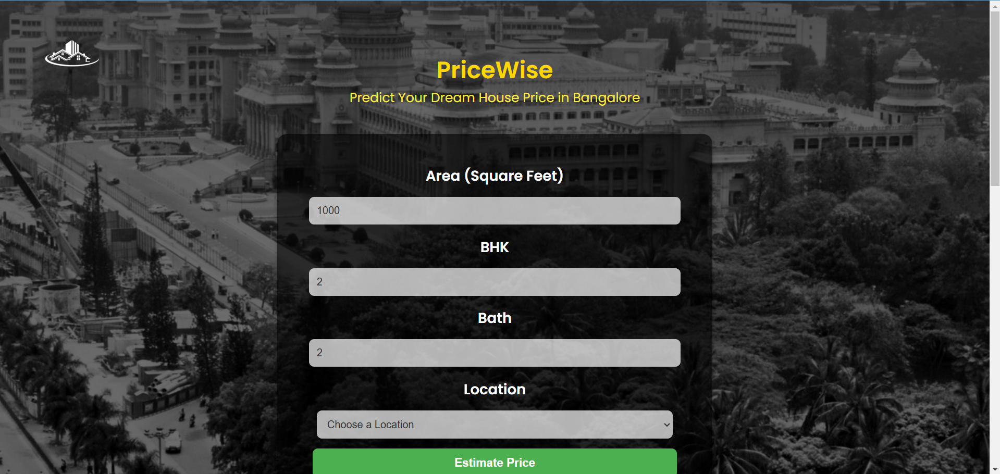
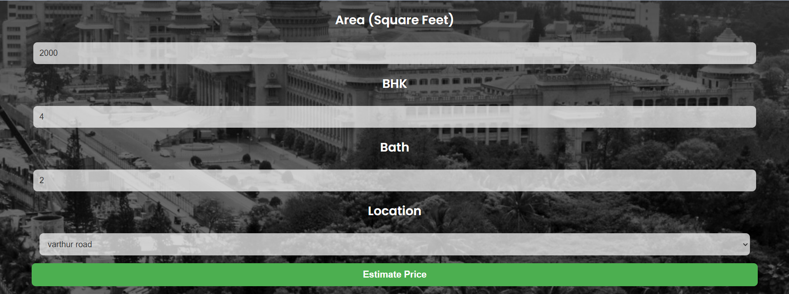
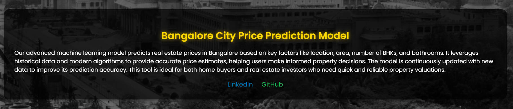
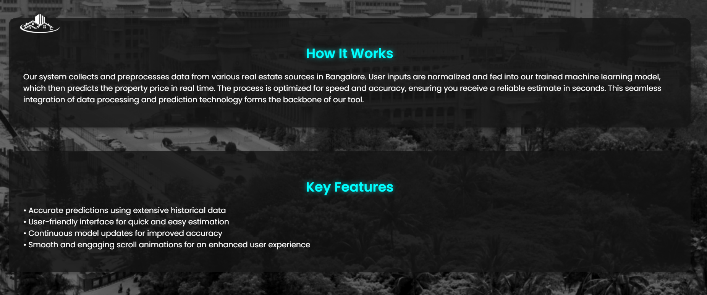

# 🏙️ Bangalore Price Prediction – Your Gateway to Smart Real Estate Decisions


Welcome to the **Bangalore Price Prediction** project! This platform leverages advanced machine learning techniques to forecast property prices in Bangalore with impressive accuracy. Whether you’re a homebuyer, seller, or investor, our model is here to empower your decisions with data-driven insights. Embrace the future of real estate with our state-of-the-art predictive engine! 🏡📈



---

## 🔗 Live Demo  
🎥 Watch the demo: [Click Here](priceprediction.mp4)  

---
## 🔍 About the Project

The **Bangalore Price Prediction** project is designed to tackle the complexities of the dynamic Bangalore real estate market. By analyzing historical property data—incorporating details like area (in sq. ft.), number of BHKs, bathrooms, and location—the model provides accurate price estimates that reflect real market conditions.

Key aspects include:

- **Data-Driven Analysis:** Leveraging rich datasets to capture market trends.
- **Advanced Machine Learning:** Utilizes multiple regression techniques such as **Linear Regression**, **Lasso Regression**, and **Decision Tree Regression**.
- **Hyperparameter Optimization:** Employs **GridSearchCV** to fine-tune models for optimal performance.
- **Real-Time Predictions:** Delivers instant insights to help users make informed real estate decisions.

Let our model be your guide in navigating Bangalore's bustling property market! 🌆💼

---

## 🎯 Features

- ✅ **User-Friendly Interface:** Seamless data entry and intuitive navigation.
- ✅ **Real-Time Price Predictions:** Get instant, reliable pricing estimates.
- ✅ **Optimized Model Selection:** Uses **GridSearchCV** to choose the best-performing model among **Linear Regression, Lasso, and Decision Tree**.
- ✅ **Multiple Regression Techniques:** Compares various models to ensure robust predictions.
- ✅ **Modern & Responsive Design:** Built for both desktop and mobile users.
- ✅ **Detailed Performance Metrics:** Displays evaluation scores (R², MAE, RMSE) for complete transparency. 📊✨

---

## ⚙️ Model Training & Optimization

Our machine learning pipeline is designed with precision:

1. **Data Preprocessing:**
   - Cleaning raw data, handling missing values, and encoding categorical features.
2. **Model Training:**
   - Implementing **Linear Regression**, **Lasso Regression**, and **Decision Tree Regression**.
3. **Hyperparameter Tuning:**
   - Using **GridSearchCV** to identify the optimal parameters for each model.
4. **Performance Evaluation:**
   - Assessing models with metrics like R², Mean Absolute Error (MAE), and Root Mean Squared Error (RMSE).

This systematic approach ensures that our predictions are both accurate and reliable in the ever-changing Bangalore market. 🔍💡

---

## 📸 Screenshots

### Input Interface
Kick off your prediction journey by entering property details through our intuitive interface:


### Prediction Results
View comprehensive prediction outputs along with key performance metrics:


### Banglore City
Use of Banglore city images to make a effect on Website


---

## 🚀 Installation

To set up the project locally, follow these steps:

1. **Clone the Repository:**
   ```bash
   git clone https://github.com/hardik0903/Bangalore-Price-Prediction.git
   cd Bangalore-Price-Prediction

2. **Install Dependencies:**
   ```bash
   pip install -r requirements.txt

3. **Start the Application**
Finally, start the application by running:
   ```bash
   python app.py

Once the server is running, open your browser and navigate to:

http://127.0.0.1:5000/

## About Section

Our advanced machine learning model predicts real estate prices in Bangalore based on key factors like location, area, number of BHKs, and bathrooms. It leverages historical data and modern algorithms to provide accurate price estimates, helping users make informed property decisions. The model is continuously updated with new data to improve its prediction accuracy. This tool is ideal for both home buyers and real estate investors who need quick and reliable property valuations.



## Working and Features

The process is optimized for speed and accuracy, ensuring you receive a reliable estimate in seconds. This seamless integration of data processing and prediction technology forms the backbone of our tool.




## 🎊 Conclusion

By following these steps, you should have a fully functional local setup of the Bangalore Price Prediction project. Enjoy exploring the data and making informed real estate decisions! 🚀🏙️💡

## 👥 Contributors  

We appreciate all contributions to this project! 🚀  

👤 **Hardik Pandey**  
- GitHub: [@hardik0903](https://github.com/hardik0903)  
- LinkedIn: https://www.linkedin.com/in/hardik-pandey-4a836628a/

Want to contribute? Feel free to fork the repository, create a new branch, and submit a pull request. Your ideas and improvements are always welcome! 💡  
